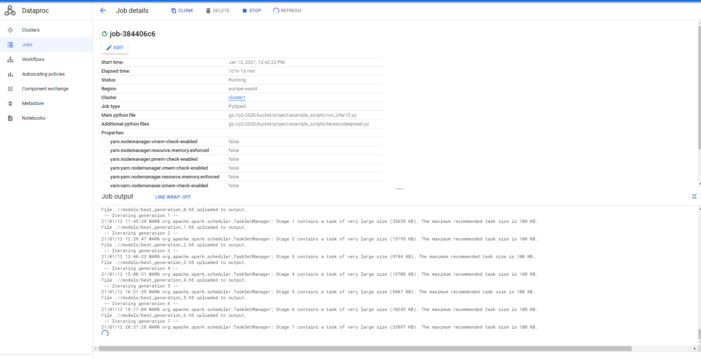
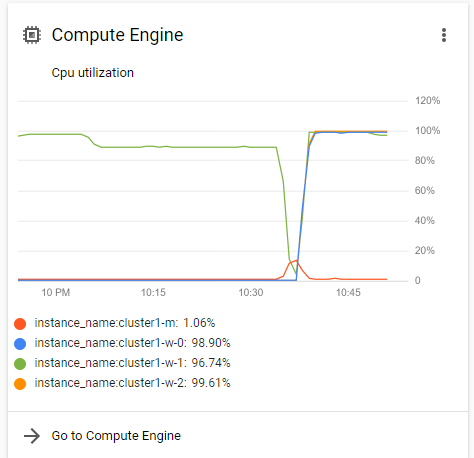
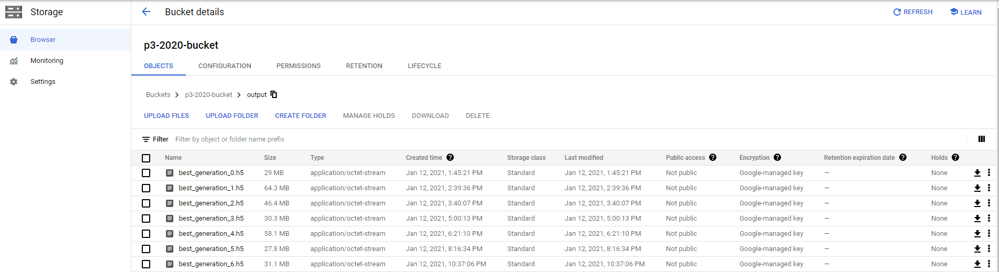

# Keras-CoDeepNEAT using Spark 
[CoDeepNEAT](https://arxiv.org/abs/1703.00548) inspired implementation using Keras and Tensorflow as backend.

# General instructions

Download the repository and import the ``example_scripts/kerascodeepneat.py`` file into your Python Script.
This will give you access to the Population and Dataset classes, which are the only necessary classes to run the entire process.

Configuration parameters must be set, as in the examples ``run_cifar10.py`` and ``run_mnist.py`` in [Example Scripts](https://github.com/rzaharia/Keras-CoDeepNEAT/tree/master/example_scripts)

## How to use in Google Cloud

Create a bucket in Google Cloud: ``gsutil mb -p PROJECT_ID -l BUCKET_LOCATION <name>``

Import the the core script ``kerascodeepneat.py`` and add the script which imports and and is the main, for exmple [run_cifar10.py](https://github.com/rzaharia/Keras-CoDeepNEAT/blob/master/example_scripts/run_cifar10.py). Those two will be used when we create the pyspark job, main file and the secondary python file.

We automated the creation of the cluster and it has a self deletetion after 5 minutes of being idle.

The entire command is found in: ``cloud_init/google_cloud_create_cluster.txt``. The cluster is installing the required packages leaving it ready for use after intallation.

We found a lot of problems during parallelizing the models:
 - The yarn need a lot of memmory so we disabled the memmory checks instead of incresing them because on some OS they were bugged.
 - We found that the minimum RAM should be higher than 16 GB

We found that having 3 workers worked very well with `cifar_10`.
Our optimal compute imstace is: `n1-highmem-8` (8 vCPUs, 52 GB memory) for worker and for master the the master could have less resources.

# Outputs

The framework generates at every iteration the best model that could be obtained from a low number of training epochs, and after some many iteration, the best one gets trained for many times.

- The model is saved into the bucket because the job intermediary options are lost when the job is done.

## Example Scripts

- ``run_mnist.py`` describes a sample run using the MNIST dataset.

- ``run_cifar10.py`` describes a sample run using the CIFAR-10 dataset.

## Expected bucket output

## Requirements
- Keras 2.2.5
- Tensorflow 1.13.1.
- Networkx 2.3.
- PyDot 1.4.1
- GraphViz 0.11.1
- SkLearn 0.21.3
- google-cloud-storage
- matplotlib
- pyspark

## [Initial README.md](https://github.com/sbcblab/Keras-CoDeepNEAT/blob/master/README.md) 